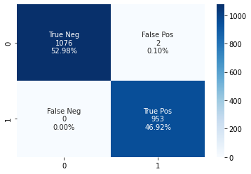

# Mushroom Classifier

```python
import pandas as pd
import numpy as np
```


```python
data = pd.read_csv("mushrooms.csv")
data
```


<div>
<style scoped>
    .dataframe tbody tr th:only-of-type {
        vertical-align: middle;
    }

    .dataframe tbody tr th {
        vertical-align: top;
    }

    .dataframe thead th {
        text-align: right;
    }
</style>
<table border="1" class="dataframe">
  <thead>
    <tr style="text-align: right;">
      <th></th>
      <th>class</th>
      <th>cap-shape</th>
      <th>cap-surface</th>
      <th>cap-color</th>
      <th>bruises</th>
      <th>odor</th>
      <th>gill-attachment</th>
      <th>gill-spacing</th>
      <th>gill-size</th>
      <th>gill-color</th>
      <th>...</th>
      <th>stalk-surface-below-ring</th>
      <th>stalk-color-above-ring</th>
      <th>stalk-color-below-ring</th>
      <th>veil-type</th>
      <th>veil-color</th>
      <th>ring-number</th>
      <th>ring-type</th>
      <th>spore-print-color</th>
      <th>population</th>
      <th>habitat</th>
    </tr>
  </thead>
  <tbody>
    <tr>
      <th>0</th>
      <td>p</td>
      <td>x</td>
      <td>s</td>
      <td>n</td>
      <td>t</td>
      <td>p</td>
      <td>f</td>
      <td>c</td>
      <td>n</td>
      <td>k</td>
      <td>...</td>
      <td>s</td>
      <td>w</td>
      <td>w</td>
      <td>p</td>
      <td>w</td>
      <td>o</td>
      <td>p</td>
      <td>k</td>
      <td>s</td>
      <td>u</td>
    </tr>
    <tr>
      <th>1</th>
      <td>e</td>
      <td>x</td>
      <td>s</td>
      <td>y</td>
      <td>t</td>
      <td>a</td>
      <td>f</td>
      <td>c</td>
      <td>b</td>
      <td>k</td>
      <td>...</td>
      <td>s</td>
      <td>w</td>
      <td>w</td>
      <td>p</td>
      <td>w</td>
      <td>o</td>
      <td>p</td>
      <td>n</td>
      <td>n</td>
      <td>g</td>
    </tr>
    <tr>
      <th>2</th>
      <td>e</td>
      <td>b</td>
      <td>s</td>
      <td>w</td>
      <td>t</td>
      <td>l</td>
      <td>f</td>
      <td>c</td>
      <td>b</td>
      <td>n</td>
      <td>...</td>
      <td>s</td>
      <td>w</td>
      <td>w</td>
      <td>p</td>
      <td>w</td>
      <td>o</td>
      <td>p</td>
      <td>n</td>
      <td>n</td>
      <td>m</td>
    </tr>
    <tr>
      <th>3</th>
      <td>p</td>
      <td>x</td>
      <td>y</td>
      <td>w</td>
      <td>t</td>
      <td>p</td>
      <td>f</td>
      <td>c</td>
      <td>n</td>
      <td>n</td>
      <td>...</td>
      <td>s</td>
      <td>w</td>
      <td>w</td>
      <td>p</td>
      <td>w</td>
      <td>o</td>
      <td>p</td>
      <td>k</td>
      <td>s</td>
      <td>u</td>
    </tr>
    <tr>
      <th>4</th>
      <td>e</td>
      <td>x</td>
      <td>s</td>
      <td>g</td>
      <td>f</td>
      <td>n</td>
      <td>f</td>
      <td>w</td>
      <td>b</td>
      <td>k</td>
      <td>...</td>
      <td>s</td>
      <td>w</td>
      <td>w</td>
      <td>p</td>
      <td>w</td>
      <td>o</td>
      <td>e</td>
      <td>n</td>
      <td>a</td>
      <td>g</td>
    </tr>
    <tr>
      <th>...</th>
      <td>...</td>
      <td>...</td>
      <td>...</td>
      <td>...</td>
      <td>...</td>
      <td>...</td>
      <td>...</td>
      <td>...</td>
      <td>...</td>
      <td>...</td>
      <td>...</td>
      <td>...</td>
      <td>...</td>
      <td>...</td>
      <td>...</td>
      <td>...</td>
      <td>...</td>
      <td>...</td>
      <td>...</td>
      <td>...</td>
      <td>...</td>
    </tr>
    <tr>
      <th>8119</th>
      <td>e</td>
      <td>k</td>
      <td>s</td>
      <td>n</td>
      <td>f</td>
      <td>n</td>
      <td>a</td>
      <td>c</td>
      <td>b</td>
      <td>y</td>
      <td>...</td>
      <td>s</td>
      <td>o</td>
      <td>o</td>
      <td>p</td>
      <td>o</td>
      <td>o</td>
      <td>p</td>
      <td>b</td>
      <td>c</td>
      <td>l</td>
    </tr>
    <tr>
      <th>8120</th>
      <td>e</td>
      <td>x</td>
      <td>s</td>
      <td>n</td>
      <td>f</td>
      <td>n</td>
      <td>a</td>
      <td>c</td>
      <td>b</td>
      <td>y</td>
      <td>...</td>
      <td>s</td>
      <td>o</td>
      <td>o</td>
      <td>p</td>
      <td>n</td>
      <td>o</td>
      <td>p</td>
      <td>b</td>
      <td>v</td>
      <td>l</td>
    </tr>
    <tr>
      <th>8121</th>
      <td>e</td>
      <td>f</td>
      <td>s</td>
      <td>n</td>
      <td>f</td>
      <td>n</td>
      <td>a</td>
      <td>c</td>
      <td>b</td>
      <td>n</td>
      <td>...</td>
      <td>s</td>
      <td>o</td>
      <td>o</td>
      <td>p</td>
      <td>o</td>
      <td>o</td>
      <td>p</td>
      <td>b</td>
      <td>c</td>
      <td>l</td>
    </tr>
    <tr>
      <th>8122</th>
      <td>p</td>
      <td>k</td>
      <td>y</td>
      <td>n</td>
      <td>f</td>
      <td>y</td>
      <td>f</td>
      <td>c</td>
      <td>n</td>
      <td>b</td>
      <td>...</td>
      <td>k</td>
      <td>w</td>
      <td>w</td>
      <td>p</td>
      <td>w</td>
      <td>o</td>
      <td>e</td>
      <td>w</td>
      <td>v</td>
      <td>l</td>
    </tr>
    <tr>
      <th>8123</th>
      <td>e</td>
      <td>x</td>
      <td>s</td>
      <td>n</td>
      <td>f</td>
      <td>n</td>
      <td>a</td>
      <td>c</td>
      <td>b</td>
      <td>y</td>
      <td>...</td>
      <td>s</td>
      <td>o</td>
      <td>o</td>
      <td>p</td>
      <td>o</td>
      <td>o</td>
      <td>p</td>
      <td>o</td>
      <td>c</td>
      <td>l</td>
    </tr>
  </tbody>
</table>
<p>8124 rows × 23 columns</p>
</div>


```python
data.info()
```

    <class 'pandas.core.frame.DataFrame'>
    RangeIndex: 8124 entries, 0 to 8123
    Data columns (total 23 columns):
     #   Column                    Non-Null Count  Dtype 
    ---  ------                    --------------  ----- 
     0   class                     8124 non-null   object
     1   cap-shape                 8124 non-null   object
     2   cap-surface               8124 non-null   object
     3   cap-color                 8124 non-null   object
     4   bruises                   8124 non-null   object
     5   odor                      8124 non-null   object
     6   gill-attachment           8124 non-null   object
     7   gill-spacing              8124 non-null   object
     8   gill-size                 8124 non-null   object
     9   gill-color                8124 non-null   object
     10  stalk-shape               8124 non-null   object
     11  stalk-root                8124 non-null   object
     12  stalk-surface-above-ring  8124 non-null   object
     13  stalk-surface-below-ring  8124 non-null   object
     14  stalk-color-above-ring    8124 non-null   object
     15  stalk-color-below-ring    8124 non-null   object
     16  veil-type                 8124 non-null   object
     17  veil-color                8124 non-null   object
     18  ring-number               8124 non-null   object
     19  ring-type                 8124 non-null   object
     20  spore-print-color         8124 non-null   object
     21  population                8124 non-null   object
     22  habitat                   8124 non-null   object
    dtypes: object(23)
    memory usage: 1.4+ MB
    


```python
data = data.drop(columns=data.nunique()[data.nunique() == 1].index)
```


```python
missing_values = [np.nan, "", " ", None]

data.isin(missing_values).mean().sort_values(ascending=False) * 100

data.info()
```

    <class 'pandas.core.frame.DataFrame'>
    RangeIndex: 8124 entries, 0 to 8123
    Data columns (total 22 columns):
     #   Column                    Non-Null Count  Dtype 
    ---  ------                    --------------  ----- 
     0   class                     8124 non-null   object
     1   cap-shape                 8124 non-null   object
     2   cap-surface               8124 non-null   object
     3   cap-color                 8124 non-null   object
     4   bruises                   8124 non-null   object
     5   odor                      8124 non-null   object
     6   gill-attachment           8124 non-null   object
     7   gill-spacing              8124 non-null   object
     8   gill-size                 8124 non-null   object
     9   gill-color                8124 non-null   object
     10  stalk-shape               8124 non-null   object
     11  stalk-root                8124 non-null   object
     12  stalk-surface-above-ring  8124 non-null   object
     13  stalk-surface-below-ring  8124 non-null   object
     14  stalk-color-above-ring    8124 non-null   object
     15  stalk-color-below-ring    8124 non-null   object
     16  veil-color                8124 non-null   object
     17  ring-number               8124 non-null   object
     18  ring-type                 8124 non-null   object
     19  spore-print-color         8124 non-null   object
     20  population                8124 non-null   object
     21  habitat                   8124 non-null   object
    dtypes: object(22)
    memory usage: 1.4+ MB
    

veil-type was removed


```python
X = data.drop(columns = "class")
y = data["class"]
```


```python
X = pd.get_dummies(X, drop_first = True)
X
```


<div>
<style scoped>
    .dataframe tbody tr th:only-of-type {
        vertical-align: middle;
    }

    .dataframe tbody tr th {
        vertical-align: top;
    }

    .dataframe thead th {
        text-align: right;
    }
</style>
<table border="1" class="dataframe">
  <thead>
    <tr style="text-align: right;">
      <th></th>
      <th>cap-shape_c</th>
      <th>cap-shape_f</th>
      <th>cap-shape_k</th>
      <th>cap-shape_s</th>
      <th>cap-shape_x</th>
      <th>cap-surface_g</th>
      <th>cap-surface_s</th>
      <th>cap-surface_y</th>
      <th>cap-color_c</th>
      <th>cap-color_e</th>
      <th>...</th>
      <th>population_n</th>
      <th>population_s</th>
      <th>population_v</th>
      <th>population_y</th>
      <th>habitat_g</th>
      <th>habitat_l</th>
      <th>habitat_m</th>
      <th>habitat_p</th>
      <th>habitat_u</th>
      <th>habitat_w</th>
    </tr>
  </thead>
  <tbody>
    <tr>
      <th>0</th>
      <td>0</td>
      <td>0</td>
      <td>0</td>
      <td>0</td>
      <td>1</td>
      <td>0</td>
      <td>1</td>
      <td>0</td>
      <td>0</td>
      <td>0</td>
      <td>...</td>
      <td>0</td>
      <td>1</td>
      <td>0</td>
      <td>0</td>
      <td>0</td>
      <td>0</td>
      <td>0</td>
      <td>0</td>
      <td>1</td>
      <td>0</td>
    </tr>
    <tr>
      <th>1</th>
      <td>0</td>
      <td>0</td>
      <td>0</td>
      <td>0</td>
      <td>1</td>
      <td>0</td>
      <td>1</td>
      <td>0</td>
      <td>0</td>
      <td>0</td>
      <td>...</td>
      <td>1</td>
      <td>0</td>
      <td>0</td>
      <td>0</td>
      <td>1</td>
      <td>0</td>
      <td>0</td>
      <td>0</td>
      <td>0</td>
      <td>0</td>
    </tr>
    <tr>
      <th>2</th>
      <td>0</td>
      <td>0</td>
      <td>0</td>
      <td>0</td>
      <td>0</td>
      <td>0</td>
      <td>1</td>
      <td>0</td>
      <td>0</td>
      <td>0</td>
      <td>...</td>
      <td>1</td>
      <td>0</td>
      <td>0</td>
      <td>0</td>
      <td>0</td>
      <td>0</td>
      <td>1</td>
      <td>0</td>
      <td>0</td>
      <td>0</td>
    </tr>
    <tr>
      <th>3</th>
      <td>0</td>
      <td>0</td>
      <td>0</td>
      <td>0</td>
      <td>1</td>
      <td>0</td>
      <td>0</td>
      <td>1</td>
      <td>0</td>
      <td>0</td>
      <td>...</td>
      <td>0</td>
      <td>1</td>
      <td>0</td>
      <td>0</td>
      <td>0</td>
      <td>0</td>
      <td>0</td>
      <td>0</td>
      <td>1</td>
      <td>0</td>
    </tr>
    <tr>
      <th>4</th>
      <td>0</td>
      <td>0</td>
      <td>0</td>
      <td>0</td>
      <td>1</td>
      <td>0</td>
      <td>1</td>
      <td>0</td>
      <td>0</td>
      <td>0</td>
      <td>...</td>
      <td>0</td>
      <td>0</td>
      <td>0</td>
      <td>0</td>
      <td>1</td>
      <td>0</td>
      <td>0</td>
      <td>0</td>
      <td>0</td>
      <td>0</td>
    </tr>
    <tr>
      <th>...</th>
      <td>...</td>
      <td>...</td>
      <td>...</td>
      <td>...</td>
      <td>...</td>
      <td>...</td>
      <td>...</td>
      <td>...</td>
      <td>...</td>
      <td>...</td>
      <td>...</td>
      <td>...</td>
      <td>...</td>
      <td>...</td>
      <td>...</td>
      <td>...</td>
      <td>...</td>
      <td>...</td>
      <td>...</td>
      <td>...</td>
      <td>...</td>
    </tr>
    <tr>
      <th>8119</th>
      <td>0</td>
      <td>0</td>
      <td>1</td>
      <td>0</td>
      <td>0</td>
      <td>0</td>
      <td>1</td>
      <td>0</td>
      <td>0</td>
      <td>0</td>
      <td>...</td>
      <td>0</td>
      <td>0</td>
      <td>0</td>
      <td>0</td>
      <td>0</td>
      <td>1</td>
      <td>0</td>
      <td>0</td>
      <td>0</td>
      <td>0</td>
    </tr>
    <tr>
      <th>8120</th>
      <td>0</td>
      <td>0</td>
      <td>0</td>
      <td>0</td>
      <td>1</td>
      <td>0</td>
      <td>1</td>
      <td>0</td>
      <td>0</td>
      <td>0</td>
      <td>...</td>
      <td>0</td>
      <td>0</td>
      <td>1</td>
      <td>0</td>
      <td>0</td>
      <td>1</td>
      <td>0</td>
      <td>0</td>
      <td>0</td>
      <td>0</td>
    </tr>
    <tr>
      <th>8121</th>
      <td>0</td>
      <td>1</td>
      <td>0</td>
      <td>0</td>
      <td>0</td>
      <td>0</td>
      <td>1</td>
      <td>0</td>
      <td>0</td>
      <td>0</td>
      <td>...</td>
      <td>0</td>
      <td>0</td>
      <td>0</td>
      <td>0</td>
      <td>0</td>
      <td>1</td>
      <td>0</td>
      <td>0</td>
      <td>0</td>
      <td>0</td>
    </tr>
    <tr>
      <th>8122</th>
      <td>0</td>
      <td>0</td>
      <td>1</td>
      <td>0</td>
      <td>0</td>
      <td>0</td>
      <td>0</td>
      <td>1</td>
      <td>0</td>
      <td>0</td>
      <td>...</td>
      <td>0</td>
      <td>0</td>
      <td>1</td>
      <td>0</td>
      <td>0</td>
      <td>1</td>
      <td>0</td>
      <td>0</td>
      <td>0</td>
      <td>0</td>
    </tr>
    <tr>
      <th>8123</th>
      <td>0</td>
      <td>0</td>
      <td>0</td>
      <td>0</td>
      <td>1</td>
      <td>0</td>
      <td>1</td>
      <td>0</td>
      <td>0</td>
      <td>0</td>
      <td>...</td>
      <td>0</td>
      <td>0</td>
      <td>0</td>
      <td>0</td>
      <td>0</td>
      <td>1</td>
      <td>0</td>
      <td>0</td>
      <td>0</td>
      <td>0</td>
    </tr>
  </tbody>
</table>
<p>8124 rows × 95 columns</p>
</div>


```python
from sklearn.model_selection import train_test_split
X_train, X_test, y_train, y_test = train_test_split(X,y)
```


```python
from sklearn.linear_model import LogisticRegression
from sklearn.metrics import accuracy_score

log_reg = LogisticRegression().fit(X_train, y_train)
log_predictions = log_reg.predict(X_test)
accuracy_score(log_predictions, y_test)
```


    0.999015263417036


```python
from sklearn.ensemble import RandomForestClassifier
from sklearn.metrics import accuracy_score

random_forest_class = RandomForestClassifier()
random_forest_class.fit(X_train, y_train)
rf_predictions = log_reg.predict(X_test)
accuracy_score(rf_predictions, y_test)
```


    0.999015263417036


```python
! pip install lightgbm
```

    WARNING: There was an error checking the latest version of pip.
    

    Collecting lightgbm
      Downloading lightgbm-3.3.2-py3-none-win_amd64.whl (1.0 MB)
         ---------------------------------------- 1.0/1.0 MB 561.0 kB/s eta 0:00:00
    Requirement already satisfied: scipy in c:\users\autri ilesh banerjee\appdata\local\programs\python\python38\lib\site-packages (from lightgbm) (1.8.1)
    Requirement already satisfied: numpy in c:\users\autri ilesh banerjee\appdata\local\programs\python\python38\lib\site-packages (from lightgbm) (1.20.2)
    Requirement already satisfied: scikit-learn!=0.22.0 in c:\users\autri ilesh banerjee\appdata\local\programs\python\python38\lib\site-packages (from lightgbm) (1.1.1)
    Collecting wheel
      Downloading wheel-0.37.1-py2.py3-none-any.whl (35 kB)
    Requirement already satisfied: threadpoolctl>=2.0.0 in c:\users\autri ilesh banerjee\appdata\local\programs\python\python38\lib\site-packages (from scikit-learn!=0.22.0->lightgbm) (3.1.0)
    Requirement already satisfied: joblib>=1.0.0 in c:\users\autri ilesh banerjee\appdata\local\programs\python\python38\lib\site-packages (from scikit-learn!=0.22.0->lightgbm) (1.1.0)
    Installing collected packages: wheel, lightgbm
    Successfully installed lightgbm-3.3.2 wheel-0.37.1
    


```python
import lightgbm as lgb
clf = lgb.LGBMClassifier()
clf.fit(X_train, y_train)
light_gbm_predictions = clf.predict(X_test)
accuracy_score(light_gbm_predictions, y_test)
```


    1.0


```python
import seaborn as sns
from sklearn.metrics import confusion_matrix

def confusion_matrix_plotter(predictions, actuals):
    cf_matrix = confusion_matrix(rf_predictions, y_test)
    group_names = ['True Neg','False Pos','False Neg','True Pos']
    group_counts = ["{0:0.0f}".format(value) for value in
                    cf_matrix.flatten()]
    group_percentages = ["{0:.2%}".format(value) for value in
                        cf_matrix.flatten()/np.sum(cf_matrix)]
    labels = [f"{v1}\n{v2}\n{v3}" for v1, v2, v3 in
            zip(group_names,group_counts,group_percentages)]
    labels = np.asarray(labels).reshape(2,2)
    return sns.heatmap(cf_matrix, annot=labels, fmt="", cmap='Blues')
```


```python
confusion_matrix_plotter(light_gbm_predictions, y_test)
```


    <AxesSubplot:>


    

    


```python
confusion_matrix_plotter(log_predictions, y_test)
```


    <AxesSubplot:>


    

    


```python
confusion_matrix_plotter(rf_predictions, y_test)
```


    <AxesSubplot:>


    

    


```python
import sklearn.metrics as metrics
# calculate the fpr and tpr for all thresholds of the classification
probs = random_forest_class.predict_proba(X_test)
preds = probs[:,1]
# y_test = y_test.map({'e':1, 'p':0})
fpr, tpr, threshold = metrics.roc_curve(y_test, preds)
roc_auc = metrics.auc(tpr, fpr)

# method I: plt
import matplotlib.pyplot as plt
plt.title('Receiver Operating Characteristic')
plt.plot(tpr, fpr, 'b', label = 'AUC = %0.2f' % roc_auc)
plt.legend(loc = 'lower right')
plt.plot([0, 1], [0, 1],'r--')
plt.xlim([-0.1, 1.1])
plt.ylim([0.0, 1.1])
plt.ylabel('True Positive Rate')
plt.xlabel('False Positive Rate')
plt.show()
```


    ---------------------------------------------------------------------------

    ValueError                                Traceback (most recent call last)

    Input In [30], in <cell line: 6>()
          4 preds = probs[:,1]
          5 # y_test = y_test.map({'e':1, 'p':0})
    ----> 6 fpr, tpr, threshold = metrics.roc_curve(y_test, preds)
          7 roc_auc = metrics.auc(tpr, fpr)
          9 # method I: plt
    

    File c:\users\autri ilesh banerjee\appdata\local\programs\python\python38\lib\site-packages\sklearn\metrics\_ranking.py:979, in roc_curve(y_true, y_score, pos_label, sample_weight, drop_intermediate)
        890 def roc_curve(
        891     y_true, y_score, *, pos_label=None, sample_weight=None, drop_intermediate=True
        892 ):
        893     """Compute Receiver operating characteristic (ROC).
        894 
        895     Note: this implementation is restricted to the binary classification task.
       (...)
        977 
        978     """
    --> 979     fps, tps, thresholds = _binary_clf_curve(
        980         y_true, y_score, pos_label=pos_label, sample_weight=sample_weight
        981     )
        983     # Attempt to drop thresholds corresponding to points in between and
        984     # collinear with other points. These are always suboptimal and do not
        985     # appear on a plotted ROC curve (and thus do not affect the AUC).
       (...)
        990     # but does not drop more complicated cases like fps = [1, 3, 7],
        991     # tps = [1, 2, 4]; there is no harm in keeping too many thresholds.
        992     if drop_intermediate and len(fps) > 2:
    

    File c:\users\autri ilesh banerjee\appdata\local\programs\python\python38\lib\site-packages\sklearn\metrics\_ranking.py:755, in _binary_clf_curve(y_true, y_score, pos_label, sample_weight)
        752     y_score = y_score[nonzero_weight_mask]
        753     sample_weight = sample_weight[nonzero_weight_mask]
    --> 755 pos_label = _check_pos_label_consistency(pos_label, y_true)
        757 # make y_true a boolean vector
        758 y_true = y_true == pos_label
    

    File c:\users\autri ilesh banerjee\appdata\local\programs\python\python38\lib\site-packages\sklearn\metrics\_base.py:243, in _check_pos_label_consistency(pos_label, y_true)
        232 if pos_label is None and (
        233     classes.dtype.kind in "OUS"
        234     or not (
       (...)
        240     )
        241 ):
        242     classes_repr = ", ".join(repr(c) for c in classes)
    --> 243     raise ValueError(
        244         f"y_true takes value in {{{classes_repr}}} and pos_label is not "
        245         "specified: either make y_true take value in {0, 1} or "
        246         "{-1, 1} or pass pos_label explicitly."
        247     )
        248 elif pos_label is None:
        249     pos_label = 1
    

    ValueError: y_true takes value in {'e', 'p'} and pos_label is not specified: either make y_true take value in {0, 1} or {-1, 1} or pass pos_label explicitly.


```python
from sklearn.metrics import f1_score

f1_score(y_true = y_test, y_pred = y_pred)
```


    ---------------------------------------------------------------------------

    NameError                                 Traceback (most recent call last)

    Input In [31], in <cell line: 3>()
          1 from sklearn.metrics import f1_score
    ----> 3 f1_score(y_true = y_test, y_pred = y_pred)
    

    NameError: name 'y_pred' is not defined


```python

```
